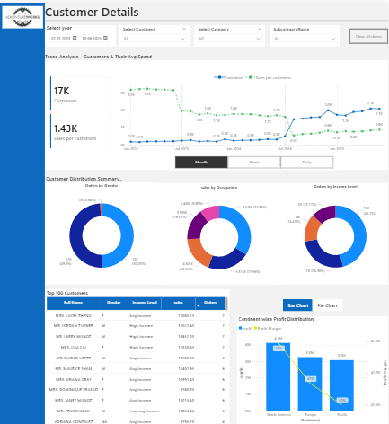
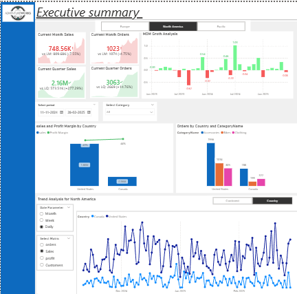

# 📊 AdventureWorks Sales Dashboard - Power BI

## 📌 Project Overview

This project is an interactive Power BI dashboard developed using the AdventureWorks dataset. The dashboard provides insights into sales performance, customer behavior, product performance, and geographical trends.

The main objective of this project is to transform raw business data into meaningful and actionable insights using Power BI.

## 🛠️ Tools & Technologies

- Power BI
- DAX
- Data Modeling
- Data Cleaning
- Data Visualization
- Business Intelligence

## 📈 Key KPIs

- Total Revenue
- Total Profit
- Profit Margin
- Total Orders
- Total Quantity
- Average Order Value
- Return Rate

## 🔍 Key Analysis

- Sales and revenue trend analysis
- Product and category performance
- Customer-level analysis
- Profitability analysis
- Order and return analysis
- Geographic sales analysis
- Time-based performance analysis

---

## 📊 Dashboard Pages

### 1. Executive Summary

Provides an overview of key business KPIs and overall sales performance.

### 2. Customer Details

Provides detailed customer analysis to understand customer purchasing behavior and performance.

### 3. Geographic Analysis

Provides geographical analysis to understand business performance across different regions and locations.

---

## 📁 Project File

The complete interactive Power BI dashboard is available in this repository:

`AdventureWorks_Sales_Dashboard.pbix`

## 🎯 Project Objective

The objective of this project is to demonstrate practical skills in:

- Power BI Dashboard Development
- DAX
- Data Modeling
- Data Analysis
- Data Visualization
- Business Insight Generation

## 💡 Key Learnings

Through this project, I gained hands-on experience in creating interactive dashboards, developing DAX measures, building data models, analyzing business data, and presenting insights through effective visualizations.

## 👤 Author

**Mehfooj Ahmad**

Aspiring Data Analyst | B.Sc. Mathematics Student
